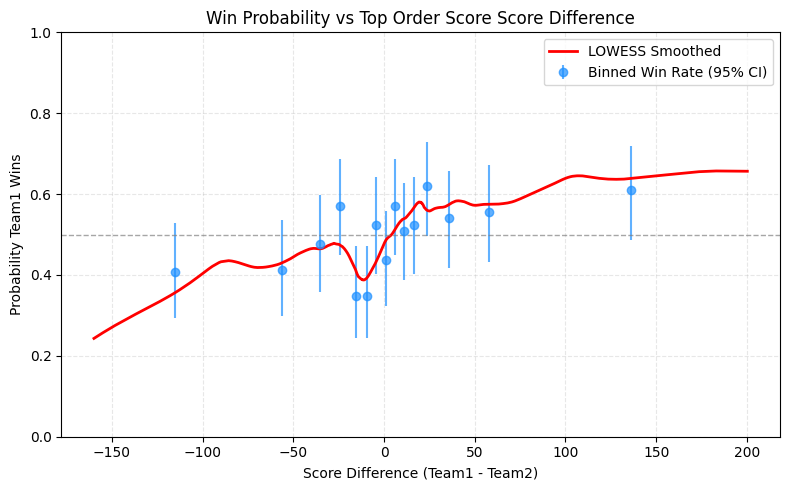
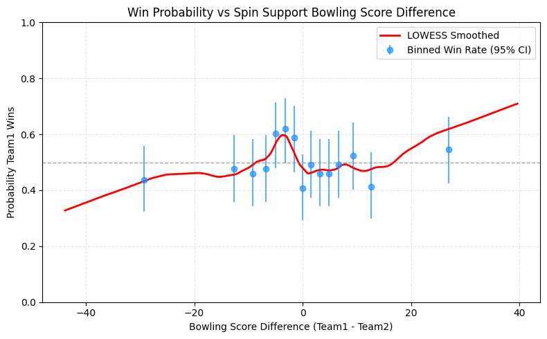

# 🏏 T20 Winner Prediction  

## 📌 Role-Based Team Strengths for Cricket Match Prediction  
**Match-level feature engineering, leakage-safe joins, role analytics, and model benchmarking**

---

## 🚀 TL;DR  
Transforms **past match-level player data** (no heavy ball-by-ball) into **role-based team strengths** (openers, top/middle/lower order; pace/spin/all-round/part-time), visualizes how **role imbalances drive wins**, and benchmarks a model zoo.  

**Results (test split):**
- 🥇 **Bagging** → Best **Accuracy/Balanced Accuracy (~0.695)**
- 🥈 **SVC** → Best **AUC (~0.688)**
- 🥉 **LDA** → Best **probability calibration** (LogLoss ~0.640, Brier ~0.225)  

👉 All features are computed **only from prior matches** to strictly avoid data leakage.  

---

## 💡 Why this project matters
- 🎯 **Game-aware features** → Converts raw player history into **role-specific strengths** that reflect how teams actually win.  
- 🔒 **Leakage-proof** → Strict **time-aware joins**; current match excluded from aggregates.  
- 📊 **Explainable edges** → Visual + statistical links from **role advantage → win probability**.  
- ⚡ **Deployable models** → Benchmarked & calibrated classifiers with trade-offs (accuracy vs ranking vs probability quality).  

---

## 📂 Data & Inputs
- **`bat`** → per-player match-level **batting stats** (runs, balls, 4s/6s, dismissal type, etc.)  
- **`bowl`** → per-player match-level **bowling stats** (runs conceded, balls, wickets, dots, wides/no-balls, maidens…)  
- **`match`** → match metadata + **rosters** (`team1_P1..P12`, `team2_P1..P12`) + **winner12 (1/2/0)**  
- Dates normalized to datetime; all joins **respect chronology**  

---

## ⚙️ Feature Engineering  

### 🏏 Batting (per player, pre-match)  

- **Recent form (last N matches):** runs, average, strike rate, boundary%, dismissal tendencies  
- **Career-to-date:** cumulative runs, avg, SR (excluding current match)  
- **Role assignment (by roster slot):**  
  - Openers **P1–P2**  
  - Top order **P3–P4**  
  - Middle **P5–P7**  
  - Lower/Finishers **P8–P12**  
- **Role-aware scoring:**  
  - Openers → emphasize **SR + boundary%**  
  - Top → balanced mix **avg + SR + stability**  
  - Middle → emphasize **average/stability**  
  - Lower → emphasize **SR + boundary%**  

### 🎯 Bowling (per player, pre-match)  

- **Recent form (last N):** economy, avg, SR, dot%, boundaries conceded%, extras%  
- **Career-to-date:** economy, avg, SR (excluding current match)  
- **Role grouping (by bowling score):**  
  - Pace attack (Top 3)  
  - Spin support (Next 3)  
  - All-rounders (Next 3)  
  - Part-timers (Last 3)  
- **Scoring formula:** heavier weight on **economy (career + recent)**, then **average**, plus positive weight for **dot%**  

### 🏟️ Team Features  
- Aggregate player scores → **team role strengths** (bat + bowl)  
- Target label = **`winner12`** (1 = Team1 win, 2 = Team2 win, 0 = draw/unknown)  
- Guarantee: Every feature uses **only pre-match data**  

✨ Key extra feature: **`valuable_players_ratio`** → score capturing relative past performance quality within each team.  

---

## 📊 Visual Analytics  
Dashboard Link -= https://t20winnerprediction-ks5vmzzetx8rbzoh5suako.streamlit.app/

1. **Scatter + KDE** → (Team1 vs Team2 strength) with `y=x` line → head-to-head advantage  
2. **Violin + Box** → distribution shifts for winners vs losers  
3. **Win probability curve** → binned win rates w/ **Wilson CIs + LOWESS smoothing**  
4. **Histogram** → role differences colored by outcome  
5. **ECDF** → role difference distributions split by outcome  

🔍 **Insight:** Quantifies **how much role advantage** is needed to shift **win odds**.  

---

## 🤖 Modeling & Results  

### 🔧 Preprocessing  
- `VarianceThreshold` → drop near-constant features  
- `StandardScaler` (with PCA @95% var for non-tree models)  
- **Stratified 5-fold CV** → time-aware data prep ensures no leakage  

### 🧩 Model Zoo  
- Linear: Logistic Regression, **LDA**  
- Kernel: **SVC**  
- Ensembles: Random Forest, Extra Trees, Gradient Boosting, **Bagging**  
- GBMs: XGBoost, LightGBM  
- Neural: MLP  

### 📈 Outcomes (test split) 

- ✅ **Best hard calls:** **Bagging** → Accuracy/BalAcc ≈ **0.695**  
- 🔼 **Best ranking:** **SVC** → AUC ≈ **0.688**  
- 📉 **Best probabilities:** **LDA** → LogLoss ≈ **0.640**, Brier ≈ **0.225**  

### 🏆 Practical picks  
- Need **highest hit-rate** → **Bagging**  
- Need **reliable probabilities** → **LDA** (or calibrated SVC/Bagging)  
- Need **balance** → **Soft-voting ensemble** (Bagging + SVC + LDA)  

---

## 📦 Deliverables  
- ✅ **Player feature tables** (batting & bowling: recent form + career performance)  
- ✅ **Match-level dataset** (team role strengths + winner labels)  
- ✅ **Visualization suite** (role advantage → win odds)  
- ✅ **Model benchmarking report** (metrics + rankings)  

---

## 🛠️ Tech Stack  
`pandas`, `numpy`, `scikit-learn`, `statsmodels` (LOWESS, CIs),  
`matplotlib` / `seaborn`, `xgboost`, `lightgbm`  

---

## 🎯 Conclusion  
This project demonstrates the **power of machine learning in sports analytics** by combining **historical match data, player statistics, and engineered features** to predict T20 cricket outcomes.  

- Achieved **high predictive accuracy** with **Bagging (Accuracy ~0.695)**  
- Delivered **explainable insights** through role-based visual analytics  
- Ensured **robustness** via strict leakage-safe joins and time-aware splits  
- Balanced **prediction accuracy & probability calibration** for real-world usability  

👉 Beyond predictions, this work showcases how **data-driven techniques** can improve decision-making for analysts, teams, and fans — a practical case of applying **AI/ML in real-world sports strategy**.  

---
